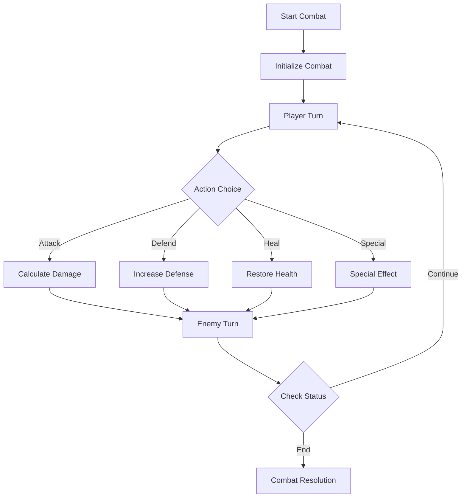

# Json2RPGDesu Technical Documentation 🛠️

## Table of Contents
- [Overview](#overview)
- [Core Components](#core-components)
- [Class Structure](#class-structure)
- [Game Mechanics](#game-mechanics)
- [UI and Display](#ui-and-display)
- [Story Management](#story-management)
- [Customization Points](#customization-points)

## Overview

`test.py` is the main game engine for Json2RPGDesu, a text-based RPG system written in Python. The engine handles story progression, combat mechanics, multiplayer interactions, and UI rendering.

### Dependencies
```python
import json          # Story data handling
import random       # RNG for combat and choices
import os           # File system operations
import time         # Animation timing
import colorama     # Terminal colors
import shutil       # Terminal size detection
import sys          # System operations
from typing import List, Dict  # Type hints
```

## Core Components

### 1. Utility Functions

#### Clear Screen
```python
def clear_screen():
    """Clear the terminal screen."""
    os.system('cls' if os.name == 'nt' else 'clear')
```

#### Health Bar Creation
```python
def create_health_bar(current: int, maximum: int, width: int = 20) -> str:
    """
    Creates a visual health bar with customizable width.
    
    Args:
        current (int): Current health value
        maximum (int): Maximum health value
        width (int): Width of the health bar (default: 20)
    
    Returns:
        str: Formatted health bar with hearts (♥ for filled, ♡ for empty)
    """
```

#### Status Box Creation
```python
def create_status_box(player: 'Player') -> str:
    """
    Creates a formatted status box displaying player information.
    
    Features:
    - Health bar
    - Attack/Defense stats
    - Status effects
    - Kawaii-style borders
    """
```

### 2. Animation System

#### Combat Animation
```python
def animate_attack(attacker: str, defender: str, damage: int):
    """
    Creates attack animation with emoticons.
    
    Animation Sequence:
    1. (ﾉ*ΦωΦ)ﾉ✧  -> Attack start
    2. ~(>_<~)    -> Impact
    3. ≧◉ᴥ◉≦     -> Reaction
    
    Customization Point:
    - Modify frames list to change animation sequence
    - Adjust time.sleep() values for timing
    """
```

#### Loading Animation
```python
def loading_animation(text="Loading", duration=2):
    """
    Displays kawaii loading animation.
    
    Features:
    - Rotating emoticons
    - Customizable duration
    - Color support
    """
```

## Class Structure

### 1. Player Class
```python
class Player:
    """
    Represents a player in the game.
    
    Attributes:
        name (str): Player name
        health (int): Current health points
        max_health (int): Maximum health points
        attack (int): Attack power
        defense (int): Defense power
        is_alive (bool): Player state
        status_effects (List[str]): Active effects
    
    Methods:
        roll_dice(): Generate random number for actions
        take_damage(): Handle damage calculations
        heal(): Restore health points
        apply_effect(): Apply status effects
    """
```

### 2. Game Class
```python
class Game:
    """
    Main game controller.
    
    Attributes:
        players (List[Player]): Active players
        current_scene (str): Current story node
        story_data (Dict): Loaded story JSON
        current_player_index (int): Active player
        combat_log (List[str]): Combat history
        scenes_visited (set): Tracking progress
    
    Key Methods:
        run(): Main game loop
        handle_combat(): Combat system
        handle_voting(): Group decision system
        make_choice(): Choice processing
        display_scene(): Scene rendering
    """
```

## Game Mechanics

### 1. Combat System
```python
def handle_combat(self, enemy_stats: Dict):
    """
    Turn-based combat system.
    
    Features:
    - Initiative system
    - Attack/Defense calculations
    - Status effect processing
    - Death handling
    
    Customization Points:
    - Modify damage calculation
    - Add new combat actions
    - Change combat flow
    """
```

### 2. Voting System
```python
def handle_voting(self, voting_system: Dict):
    """
    Group decision system.
    
    Features:
    - Multiple voting types (majority/unanimous)
    - Tie-breaker handling
    - Effect application
    
    Customization Points:
    - Add new voting types
    - Modify vote counting
    - Change result handling
    """
```

## UI and Display

### 1. Scene Display
```python
def display_scene(self):
    """
    Renders current scene.
    
    Components:
    - Title with fancy border
    - Description with color
    - Player status boxes
    - Available choices
    
    Customization Points:
    - Modify border styles
    - Add new UI elements
    - Change layout
    """
```

### 2. Progress Tracking
```python
def display_progress_bar(self):
    """
    Shows game completion progress.
    
    Features:
    - Visual progress bar
    - Percentage calculation
    - Color coding
    
    Customization Points:
    - Change progress calculation
    - Modify visual style
    - Add milestones
    """
```

## Story Management

### 1. Story Loading
```python
def load_story(self, filename: str):
    """
    Loads story data from JSON.
    
    Features:
    - JSON validation
    - Color configuration
    - Error handling
    
    Customization Points:
    - Add new story formats
    - Modify validation rules
    - Change error handling
    """
```

### 2. Choice Processing
```python
def make_choice(self, choice_index: int):
    """
    Processes player choices.
    
    Features:
    - Choice validation
    - Effect application
    - Scene transition
    
    Customization Points:
    - Add new choice types
    - Modify choice effects
    - Change transition logic
    """
```

## Customization Points

### 1. Adding New Features

#### New Choice Types
1. Create choice handler in `make_choice()`
2. Add UI elements in `display_scene()`
3. Update story JSON schema

#### New Combat Actions
1. Add action to `handle_combat()`
2. Create UI elements
3. Implement effect processing

### 2. Modifying Existing Systems

#### Combat System
```python
# In handle_combat():
damage = max(0, attacker.attack + random.randint(1, 6) - defender.defense)
# Modify formula for different combat balance
```

#### Status Effects
```python
# In Player.apply_effect():
if "buff_attack" in effect:
    self.attack += effect["buff_attack"]
# Add new effect types here
```

### 3. UI Customization

#### Colors and Styles
```python
# In create_status_box():
box = [
    f"┏{'━' * box_width}┓",
    # Modify border characters for different styles
]
```

#### Animations
```python
# In animate_attack():
frames = [
    "(ﾉ*ΦωΦ)ﾉ✧",
    "~(>_<~)",
    "≧◉ᴥ◉≦"
]
# Add or modify animation frames
```

## Best Practices

1. **Type Hints**
   - Use type hints for function parameters
   - Document return types
   - Keep type hints updated

2. **Error Handling**
   - Validate user input
   - Handle file operations safely
   - Provide meaningful error messages

3. **Code Organization**
   - Keep related functionality together
   - Use clear naming conventions
   - Comment complex logic

4. **Performance**
   - Optimize loops in combat
   - Minimize screen refreshes
   - Cache frequently used data

## Contributing

1. Fork the repository
2. Create a feature branch
3. Follow the customization guidelines
4. Submit a pull request

## Deep Dive: System Architecture 🔍

### Core Engine Flow

1. **Initialization Process**
```python
class Game:
    def __init__(self):
        self.players = []
        self.current_scene = "start"
        self.story_data = {}
        self.current_player_index = 0
        self.combat_log = []
        self.terminal_width = shutil.get_terminal_size().columns
        self.total_scenes = 0
        self.scenes_visited = set()
```

The game initializes with empty states and loads configurations. Key components:
- Player management (`self.players`)
- Scene tracking (`current_scene`, `scenes_visited`)
- Story data container (`story_data`)
- Display settings (`terminal_width`)

### Story Data Structure

1. **JSON Schema**
```json
{
  "scenes": {
    "start": {
      "description": {
        "text": "Scene description",
        "color": "cyan"
      },
      "choices": [
        {
          "type": "basic|combat|voting",
          "text": "Choice text",
          "next_scene": "target_scene_id"
        }
      ]
    }
  }
}
```

2. **Scene Processing**
```python
def display_scene(self):
    scene = self.story_data.get(self.current_scene, {})
    description = scene.get("description", {})
    text = description.get("text", "")
    color_name = description.get("color", "")
    # Process and display scene content
```

### Player Management System

1. **Player Creation**
```python
def initialize_players(self):
    """
    Creates player instances with initial stats.
    
    Modification Points:
    - Change initial stats in Player.__init__()
    - Modify number of players
    - Add custom player classes
    """
```

2. **Player State Management**
```python
class Player:
    def take_damage(self, damage: int):
        actual_damage = max(0, damage - self.defense)
        self.health = max(0, self.health - actual_damage)
        self.is_alive = self.health > 0
        return actual_damage
```

### Combat System Architecture

1. **Combat Flow**


2. **Combat Calculations**
```python
def handle_combat(self, enemy_stats: Dict):
    """
    Combat system entry point.
    
    Modification Points:
    1. Damage Calculation:
       - modify roll_dice() for different RNG
       - adjust damage formula in take_damage()
    
    2. Action System:
       - add new actions in get_player_action()
       - modify action effects
    
    3. Enemy AI:
       - change enemy_roll calculation
       - add enemy special moves
    """
```

### Choice System Architecture

1. **Choice Types and Processing**
```python
def make_choice(self, choice_index: int):
    """
    Choice processing pipeline:
    1. Validate choice
    2. Process effects
    3. Update game state
    4. Transition scene
    
    Add New Choice Type:
    1. Add type in story JSON
    2. Create handler method
    3. Add UI elements
    4. Update choice processor
    """
```

2. **Effect System**
```python
def apply_effect(self, effect: Dict):
    """
    Effect processing system.
    
    Add New Effect:
    1. Add effect type in JSON schema
    2. Create effect handler here
    3. Add UI feedback
    4. Update documentation
    """
```

### UI System Architecture

1. **Display Components**
```python
def create_status_box(player: 'Player') -> str:
    """
    UI Component Creation:
    1. Calculate dimensions
    2. Generate borders
    3. Format content
    4. Apply colors
    
    Modification Points:
    - Box style in border generation
    - Content layout in formatting
    - Color scheme in application
    """
```

2. **Animation System**
```python
def animate_attack(attacker: str, defender: str, damage: int):
    """
    Animation Pipeline:
    1. Frame generation
    2. Screen clearing
    3. Frame rendering
    4. Timing control
    
    Add New Animation:
    1. Create frame sequence
    2. Set timing
    3. Add color/effects
    4. Update cleanup
    """
```

### Save/Load System (Future Implementation)

1. **Current Placeholder**
```python
def save_game(self):
    """
    Implement Save System:
    1. Create save data structure
    2. Serialize game state
    3. Write to file
    4. Add error handling
    """
```

2. **Implementation Guide**
```python
# Proposed save data structure
save_data = {
    "players": [
        {
            "name": str,
            "health": int,
            "stats": dict,
            "effects": list
        }
    ],
    "current_scene": str,
    "scenes_visited": list,
    "game_state": dict
}
```

### Testing and Debugging

1. **Debug Points**
```python
# Add debug logging
def debug_log(self, message: str, level: str = "INFO"):
    """
    Implementation Guide:
    1. Add logging system
    2. Create debug levels
    3. Add file output
    4. Add timestamp
    """
```

2. **Test Cases**
```python
# Recommended test structure
def test_combat_system():
    """
    Test Areas:
    1. Damage calculation
    2. Status effects
    3. Death handling
    4. Combat resolution
    """
```

### Performance Optimization

1. **Critical Paths**
```python
# High-impact areas
def display_scene(self):
    # Cache frequently accessed data
    cached_scene = self._cache.get(self.current_scene)
    if not cached_scene:
        cached_scene = self._process_scene()
        self._cache[self.current_scene] = cached_scene
```

2. **Memory Management**
```python
def clear_cache(self):
    """
    Implementation Guide:
    1. Identify cache points
    2. Set cache limits
    3. Implement cleanup
    4. Monitor memory usage
    """
```

### Error Handling System

1. **Error Types**
```python
class GameError(Exception):
    """Base class for game errors"""
    pass

class StoryError(GameError):
    """Story loading/parsing errors"""
    pass

class CombatError(GameError):
    """Combat system errors"""
    pass
```

2. **Implementation Guide**
```python
def safe_operation(func):
    """
    Decorator template for error handling:
    1. Wrap critical operations
    2. Log errors
    3. Provide user feedback
    4. Maintain game state
    """
    def wrapper(*args, **kwargs):
        try:
            return func(*args, **kwargs)
        except GameError as e:
            # Handle game-specific errors
            pass
        except Exception as e:
            # Handle unexpected errors
            pass
    return wrapper
```

---

For more information about story creation, see [Story Writing Guide](story_guide.md). 